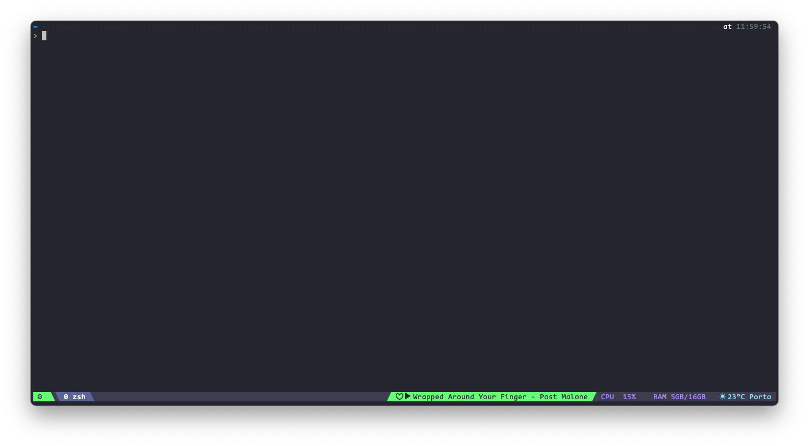

# tmux Config

- [ ] Install TPM automatically on first configuration
- [ ] Change to the specified theme automatically
- [ ] Fix "GPU Unknown" message in the status bar when using a MacBook with M1+ GPU
- [ ] Fix tmuxlaunch.sh to run when tmux is initialized, splitting into necessary panes (TBD)

## Preconditions

Before moving on, install/clone the following plugins. More details can be found in the plugin documentation.

- [tmux-powerline](https://github.com/erikw/tmux-powerline)
- [tmux plugin manager](https://github.com/tmux-plugins/tpm)
- [Spotify TUI](https://github.com/Rigellute/spotify-tui)
- [Oh My ZSH](https://ohmyz.sh/)

## Configuring

After cloned the repository, open the terminal and open tmux. Now, run the following command to source the config file from this folder. It will throw the TPM plugin error, so just ignore.

```tmux source <installed path>/dotfiles/tmux/.tmux.conf```

### Enabling the Plugins

With the plugins already installed and the binding key changed, run `bind+I` to install the rest of the plugins listed in the Plugins section in the ~/.tmux.conf file.

To see more plugin, please refer to the [TPM Plugins page](https://github.com/tmux-plugins/list).

The result after running should be similar to the following image.



### Changing the Color Scheme

Replace the `theme.sh` found in this folder with the `~/tmux-powerline/themes/default.sh`. Then, execute the `~/tmux-powerline/.generate_rc.sh` as described in the official documentation.

### Spotify plugin

It is necessaty to install the [Spotify TUI project](https://github.com/Rigellute/spotify-tui) in order to have the current playing audio in the status bar. Follow the instructions from the project setup.

## References

- [Making tmux Pretty and Usable - A Guide to Customizing your tmux.conf by Ham Vocke](https://www.hamvocke.com/blog/a-guide-to-customizing-your-tmux-conf/)
